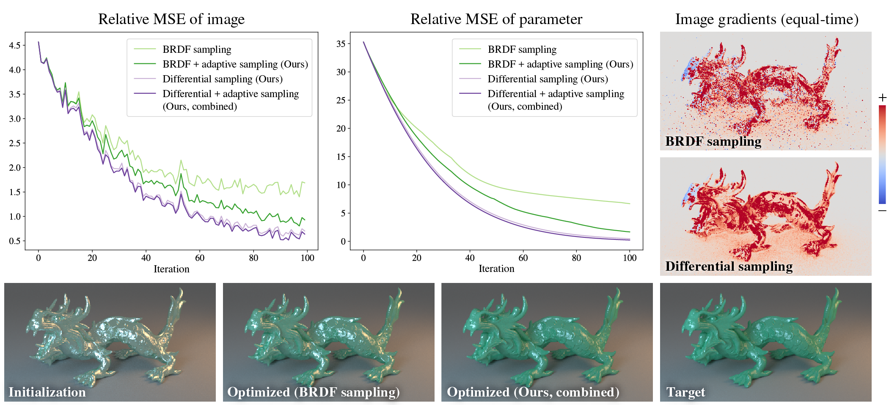

# Path Sampling Methods for Differentiable Rendering



This repository contains the Mitsuba 3 implementation and test scripts for the EGSR 2024 paper: [Path Sampling Methods for Differentiable Rendering](https://imaging.cs.cmu.edu/path_sampling_differentiable_rendering/). Please see the Mitsuba 3 [repository](https://github.com/mitsuba-renderer/mitsuba3) and [documentation](https://mitsuba.readthedocs.io/en/stable/src/developer_guide/compiling.html) for compilation instructions.

## Important files

* [src/python/python/ad/integrators/prb_diff.py](src/python/python/ad/integrators/prb_diff.py) and [prb_basic_diff.py](src/python/python/ad/integrators/prb_basic_diff.py):
    Integrators for our differential sampling method.
* [results/](results/): Test scripts for evaluating our method based on the variance of image gradients, the variance of loss gradients, and inverse rendering performance
* [results/scenes/](results/scenes/):
    Scene files used for the test scripts. The Sphere scene is from Zhang et al. (2021) and the Dragon scene is from Nicolet et al. (2023). Please download the dragon meshes from the scene data provided by [Nicolet et al. (2023)](https://rgl.epfl.ch/publications/Nicolet2023Recursive) and put them in the directory `results/scenes/dragon/meshes`.

## Citation

```bibtex
@InProceedings{Su:2024:Sampling,
	author    = {Su, Tanli and Gkioulekas, Ioannis},
	title     = {Path Sampling Methods for Differentiable Rendering},
	booktitle = {Eurographics Symposium on Rendering},
	month     = {July},
	year      = {2024},
}
```